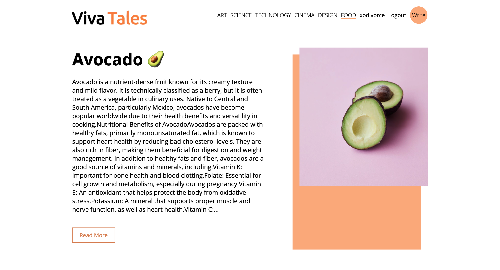
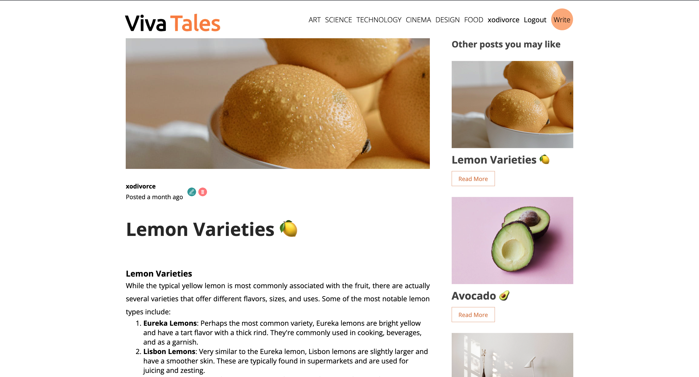

# Viva_Tales - Blog Website
### 👀 Preview:



<br>



### Viva Tales - Fully Free to Use Blog Application - Powered by [@xodivorce](https://instagram.com/xodivorce) ✨
[](https://github.com/xeorl/xeorl-portfolio/)
[](https://github.com/xeorl/xeorl-portfolio/)
[](https://github.com/xeorl/xeorl-portfolio/)
<br></br>

### 📌 Tech Stack

Here’s what fuels this site:


### ⚡ Features!

- Authentication: Users can sign up, log in, and log out of the app.
- Authorization: Only authenticated users can create, edit, view and delete their own blog posts.
- Rich Text Editing: Users can format their blog posts using headings, italic, bold, hyperlinks, numbering (1, 2, 3 or a, b, c), bullet points, and even underline text.
- One-Click Removal: Users can easily remove formatting with a single click.
- CRUD Operations: Users can create, read, update, and delete blog posts.
- Pagination: Blog posts are paginated to improve app performance.
- Filter: Blog posts can be filtered by topic.


### 🛠️ How to Contribute: Let’s Make Magic!

Want to jump in and sprinkle some magic on this project? Follow these steps:

1. **Fork and Clone**:
   - Hit “Fork” at the top-right of the page to make your copy. Then clone it to your local machine:
     ```bash
     git clone git@github.com:xodivorce/Viva_Tales.git
     ```
2. **Fire Up XAMPP**:
   - Launch XAMPP and start Apache and MySQL:
     ```bash
     # For XAMPP GUI:
     open -a XAMPP
     # Start Apache and MySQL in XAMPP Control Panel
     ```
3. **Set Up Your Local Playground**:
   - Install dependencies (both `api` and `client`):
      ```bash
      npm install
      ```
4. **Set Up Your DB**:
   - Create a new Mysql DB:
         ```bash
      blog_app
      ```
      *You can find it on `api` folder and Set up that from import into:
         ```bash
      localhost/phpmyadmin
      ```
5. **Start Up Your Playground**:
      ```bash
      npm start
      ```
      *both the `api` and `client`

6. **View Locally**:
   - Open your browser and head to:
     ```bash
     http://localhost/3000
     ```

7. **Pro Tip**: Use a Self-Signed SSL for local development to keep everything smooth and secure with HTTPS. 🔐

8. **Create a Feature Branch**:
   - Before diving in, create a new branch for your feature or fix:
     ```bash
     git checkout -b cool-new-feature
     ```

9. **Work Your Magic**:
   - Make your changes, test them, and get ready for a pull request.

10. **Commit and Push**:
   - Once you’re happy, commit and push your changes:
     ```bash
     git add .
     git commit -m "Add some cool feature"
     git push origin cool-new-feature
     ```

11. **Open a Pull Request**:
   - Go to the main repository and create a pull request. Let us know what you’ve done and why it’s awesome!

12. **Celebrate Your Contribution** 🎉:
    - Enjoy the glory of your awesome contribution! We appreciate all your help and ideas.

🚀 **Got Ideas or Spotted a Bug?**  
Don’t be shy! [*Open an issue*](https://github.com/xodivorce/Viva_Tales/issues) to discuss new features, enhancements, or any bugs you find. Your feedback is golden!!

- Let’s create something epic together! 🌟

### 📝 License & Usage

Viva_Tales - Blog Application is a Fully Open Sourced Project licensed under [**MIT LICENSE**](LICENSE.txt). Anyone can view, modify, use (personal and commercial) or distribute its sources under the conditions specified in the license. Please note that the name "Viva Tales" and any associated images cannot be used for deployment or publication purposes without prior written permission from the author. For adding new features or modifications, you must contact the author at *hey@xodivorce.in*.

**🌟 Like this project? Please consider giving it a star to show your support!**

<br></br>

****

An Open Sourced Project - Crafted with ❤️ by **xodivorce**